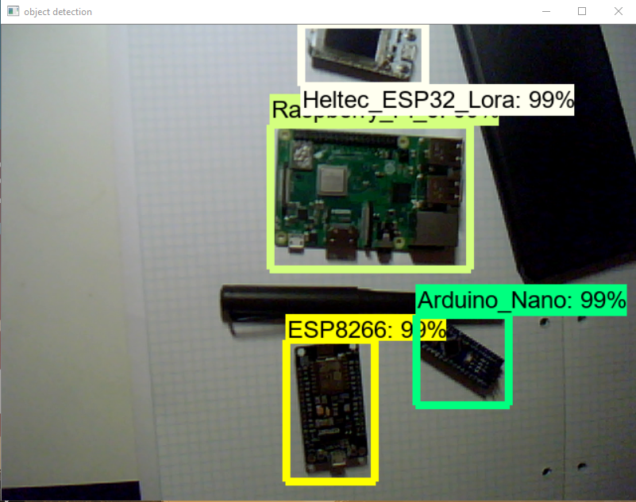
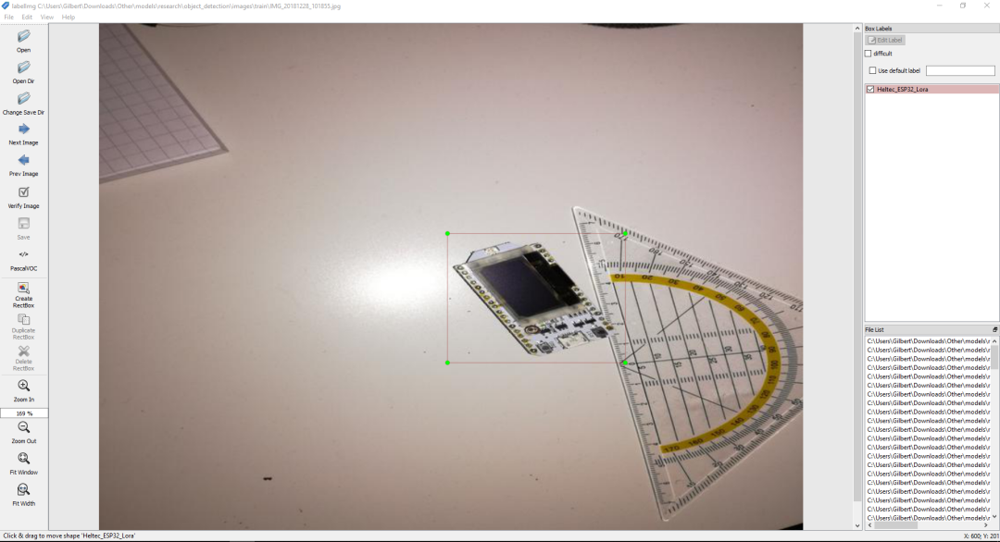
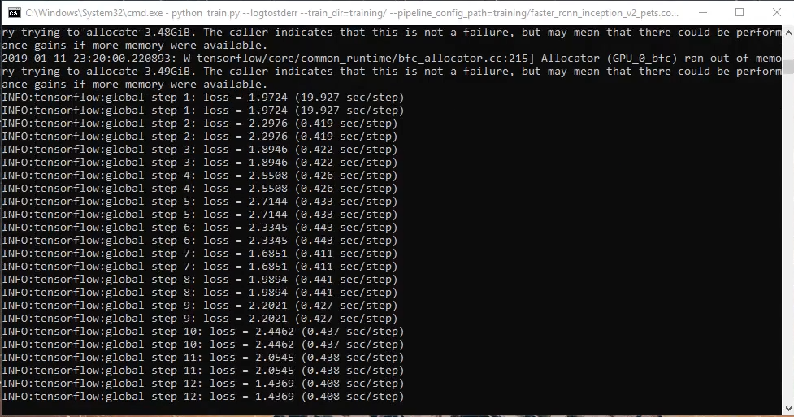
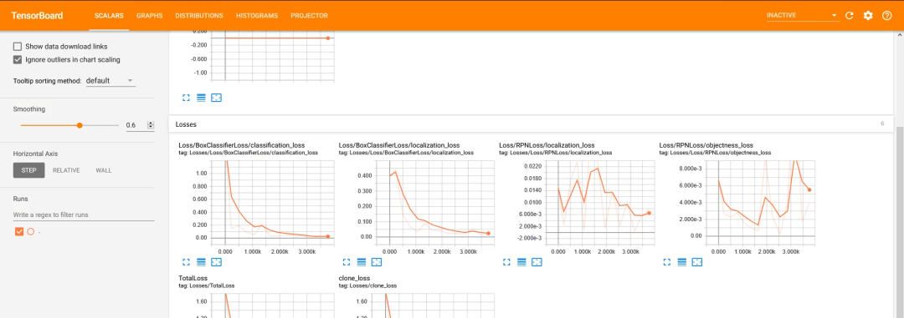

# How to train a custom object detection model with the Tensorflow Object Detection API
(ReadME inspired by [EdjeElectronics](https://github.com/EdjeElectronics))

> Update: This README and Repository is now fully updated for Tensorflow 2. If you want to use Tensorflow 1 instead check out [my article](https://gilberttanner.com/blog/creating-your-own-objectdetector). If you want to train your model in Google Colab check out [the Tensorflow_2_Object_Detection_Train_model notebook](Tensorflow_2_Object_Detection_Train_model.ipynb).



## Introduction

## Steps:

### 1. Installation

You can install the TensorFlow Object Detection API either with Python Package Installer (pip) or [Docker](https://www.docker.com/), an open-source platform for deploying and managing containerized applications. For running the Tensorflow Object Detection API locally, Docker is recommended. If you aren't familiar with Docker though, it might be easier to install it using pip.

First clone the master branch of the Tensorflow Models repository:

```bash
git clone https://github.com/tensorflow/models.git
```

#### Docker Installation

```
# From the root of the git repository (inside the models directory)
docker build -f research/object_detection/dockerfiles/tf2/Dockerfile -t od .
docker run -it od
```

#### Python Package Installation

```
cd models/research
# Compile protos.
protoc object_detection/protos/*.proto --python_out=.
# Install TensorFlow Object Detection API.
cp object_detection/packages/tf2/setup.py .
python -m pip install .
```

> Note: The *.proto designating all files does not work protobuf version 3.5 and higher. If you are using version 3.5, you have to go through each file individually. To make this easier, I created a python script that loops through a directory and converts all proto files one at a time.

```python
import os
import sys
args = sys.argv
directory = args[1]
protoc_path = args[2]
for file in os.listdir(directory):
    if file.endswith(".proto"):
        os.system(protoc_path+" "+directory+"/"+file+" --python_out=.")
```

```
python use_protobuf.py <path to directory> <path to protoc file>
```

To test the installation run:

```
# Test the installation.
python object_detection/builders/model_builder_tf2_test.py
```

If everything installed correctly you should see something like:

```
...
[       OK ] ModelBuilderTF2Test.test_create_ssd_models_from_config
[ RUN      ] ModelBuilderTF2Test.test_invalid_faster_rcnn_batchnorm_update
[       OK ] ModelBuilderTF2Test.test_invalid_faster_rcnn_batchnorm_update
[ RUN      ] ModelBuilderTF2Test.test_invalid_first_stage_nms_iou_threshold
[       OK ] ModelBuilderTF2Test.test_invalid_first_stage_nms_iou_threshold
[ RUN      ] ModelBuilderTF2Test.test_invalid_model_config_proto
[       OK ] ModelBuilderTF2Test.test_invalid_model_config_proto
[ RUN      ] ModelBuilderTF2Test.test_invalid_second_stage_batch_size
[       OK ] ModelBuilderTF2Test.test_invalid_second_stage_batch_size
[ RUN      ] ModelBuilderTF2Test.test_session
[  SKIPPED ] ModelBuilderTF2Test.test_session
[ RUN      ] ModelBuilderTF2Test.test_unknown_faster_rcnn_feature_extractor
[       OK ] ModelBuilderTF2Test.test_unknown_faster_rcnn_feature_extractor
[ RUN      ] ModelBuilderTF2Test.test_unknown_meta_architecture
[       OK ] ModelBuilderTF2Test.test_unknown_meta_architecture
[ RUN      ] ModelBuilderTF2Test.test_unknown_ssd_feature_extractor
[       OK ] ModelBuilderTF2Test.test_unknown_ssd_feature_extractor
----------------------------------------------------------------------
Ran 20 tests in 91.767s

OK (skipped=1)
```

### 2. Gathering data

Now that the Tensorflow Object Detection API is ready to go, we need to gather the images needed for training. 

To train a robust model, the pictures should be as diverse as possible. So they should have different backgrounds, varying lighting conditions, and unrelated random objects in them.

You can either take pictures yourself, or you can download pictures from the internet. For my microcontroller detector, I took about 25 pictures of each individual microcontroller and 25 pictures containing multiple microcontrollers.


You can use the [resize_images script](resize_images.py) to resize the image to the wanted resolutions.

```bash
python resize_images.py -d images/ -s 800 600
```

After you have all the images, move about 80% to the object_detection/images/train directory and the other 20% to the object_detection/images/test directory. Make sure that the images in both directories have a good variety of classes.

### 3. Labeling data

With all the pictures gathered, we come to the next step - labeling the data. Labeling is the process of drawing bounding boxes around the desired objects.

LabelImg is a great tool for creating an object detection data-set.

[LabelImg GitHub](https://github.com/tzutalin/labelImg)

[LabelImg Download](https://www.dropbox.com/s/tq7zfrcwl44vxan/windows_v1.6.0.zip?dl=1)

Download and install LabelImg. Then point it to your images/train and images/test directories, and draw a box around each object in each image.



LabelImg supports two formats, PascalVOC and Yolo. For this tutorial, make sure to select PascalVOC. LabelImg saves a xml file containing the label data for each image. These files will be used to create a tfrecord file, which can be used to train the model.

### 4. Generating Training data

With the images labeled, we need to create TFRecords that can be served as input data for training the object detector. To create the TFRecords, we will first convert the XML label files created with LabelImg to one CSV file using the [xml_to_csv.py script](xml_to_csv.py). 

```bash
python xml_to_csv.py
```

The above command creates two files in the images directory. One is called test_labels.csv, and another one is called train_labels.csv. Next, we'll convert the CSV files into TFRecords files. For this, open the [generate_tfrecord.py file](generate_tfrecord.py) and replace the labelmap inside the class_text_to_int method with your own label map.

Old:
```python
# TO-DO replace this with label map
def class_text_to_int(row_label):
    if row_label == 'basketball':
        return 1
    elif row_label == 'shirt':
        return 2
    elif row_label == 'shoe':
        return 3
    else:
        return None
```

New:
```python
def class_text_to_int(row_label):
    if row_label == 'Raspberry_Pi_3':
        return 1
    elif row_label == 'Arduino_Nano':
        return 2
    elif row_label == 'ESP8266':
        return 3
    elif row_label == 'Heltec_ESP32_Lora':
        return 4
    else:
        return None
```

Now the TFRecord files can be generated by typing:

```bash
python generate_tfrecord.py --csv_input=images/train_labels.csv --image_dir=images/train --output_path=train.record
python generate_tfrecord.py --csv_input=images/test_labels.csv --image_dir=images/test --output_path=test.record
```

These two commands generate a train.record and a test.record file, which can be used to train our object detector.

### 5. Getting ready for training

The last thing we need to do before training is to create a label map and a training configuration file.

#### 5.1 Creating a label map

The label map maps an id to a name. We will put it in a folder called training, which is located in the object_detection directory. The labelmap for my detector can be seen below.

```python
item {
    id: 1
    name: 'Raspberry_Pi_3'
}
item {
    id: 2
    name: 'Arduino_Nano'
}
item {
    id: 3
    name: 'ESP8266'
}
item {
    id: 4
    name: 'Heltec_ESP32_Lora'
}
```

The id number of each item should match the id of specified in the generate_tfrecord.py file.

#### 5.2 Creating the training configuration

Lastly, we need to create a training configuration file. As a base model, I will use EfficientDet – a recent family of SOTA models discovered with the help of Neural Architecture Search. The Tensorflow OD API provides a lot of different models. For more information check out the [Tensorflow 2 Detection Model Zoo](https://github.com/tensorflow/models/blob/master/research/object_detection/g3doc/tf2_detection_zoo.md)

The [base config](https://github.com/tensorflow/models/blob/master/research/object_detection/configs/tf2/ssd_efficientdet_d0_512x512_coco17_tpu-8.config) for the model can be found inside the [configs/tf2 folder](https://github.com/tensorflow/models/tree/master/research/object_detection/configs/tf2).

Copy the config file to the training directory. Then open it inside a text editor and make the following changes:

* Line 13: change the number of classes to number of objects you want to detect (4 in my case)

* Line 141: change fine_tune_checkpoint to the path of the model.ckpt file:

    * ```fine_tune_checkpoint: "<path>/efficientdet_d0_coco17_tpu-32/checkpoint/ckpt-0"```

* Line 143: Change ```fine_tune_checkpoint_type``` to detection

* Line 182: change input_path to the path of the train.records file:

    * ```input_path: "<path>/train.record"```

* Line 197: change input_path to the path of the test.records file:

    * ```input_path: "<path>/test.record"```

* Line 180 and 193: change label_map_path to the path of the label map:

    * ```label_map_path: "<path>/labelmap.pbtxt"```

* Line 144 and 189: change batch_size to a number appropriate for your hardware, like 4, 8, or 16.

### 6. Training the model

To train the model, execute the following command in the command line:

```bash
python model_main_tf2.py --pipeline_config_path=training/ssd_efficientdet_d0_512x512_coco17_tpu-8.config --model_dir=training --alsologtostderr
```

If everything was setup correctly, the training should begin shortly, and you should see something like the following:



Every few minutes, the current loss gets logged to Tensorboard. Open Tensorboard by opening a second command line, navigating to the object_detection folder and typing:

```tensorboard --logdir=training/train```

This will open a webpage at localhost:6006.



The training script saves checkpoints about every five minutes. Train the model until it reaches a satisfying loss, then you can terminate the training process by pressing Ctrl+C.

### 7. Exporting the inference graph

Now that we have a trained model, we need to generate an inference graph that can be used to run the model.

```bash
python /content/models/research/object_detection/exporter_main_v2.py \
    --trained_checkpoint_dir training \
    --output_directory inference_graph \
    --pipeline_config_path training/ssd_efficientdet_d0_512x512_coco17_tpu-8.config
```

### 8. Using the model for inference

After training the model it can be used in many ways. For examples on how to use the model check out my other repositories.

* [Tensorflow-Object-Detection-with-Tensorflow-2.0](https://github.com/TannerGilbert/Tensorflow-Object-Detection-with-Tensorflow-2.0)

## Appendix

### Common Questions

#### 1. How do I extract the images inside the bounding boxes?

```python
output_directory = 'some dir'

# get label and coordinates of detected objects
output = []
for index, score in enumerate(output_dict['detection_scores']):
    label = category_index[output_dict['detection_classes'][index]]['name']
    ymin, xmin, ymax, xmax = output_dict['detection_boxes'][index]
    output.append((label, int(xmin * image_width), int(ymin * image_height), int(xmax * image_width), int(ymax * image_height)))

# Save images and labels
for l, x_min, y_min, x_max, y_max in output:
    array = cv2.cvtColor(np.array(image_show), cv2.COLOR_RGB2BGR)
    image = Image.fromarray(array)
    cropped_img = image.crop((x_min, y_min, x_max, y_max))
    file_path = output_directory+'/images/'+str(len(df))+'.jpg'
    cropped_img.save(file_path, "JPEG", icc_profile=cropped_img.info.get('icc_profile'))
    df.loc[len(df)] = [datetime.datetime.now(), file_path]
    df.to_csv(output_directory+'/results.csv', index=None
``` 

#### 2. How do I host a model?

There are multiple ways to host a model. You can create a Restful API with [Tensorflow Serving](https://github.com/tensorflow/serving) or by creating your own websites. You can also integrate the model into a website by transforming your model to [Tensorflow Lite](https://www.tensorflow.org/lite/convert). 

## Contribution

Anyone is welcome to contribute to this repository, however, if you decide to do so I would appreciate it if you take a moment and review the [guidelines](./.github/CONTRIBUTING.md).

## Author
 **Gilbert Tanner**
 
## Support me

<a href="https://www.buymeacoffee.com/gilberttanner" target="_blank"></a>

## License

This project is licensed under the MIT License - see the [LICENSE.md](LICENSE) file for details